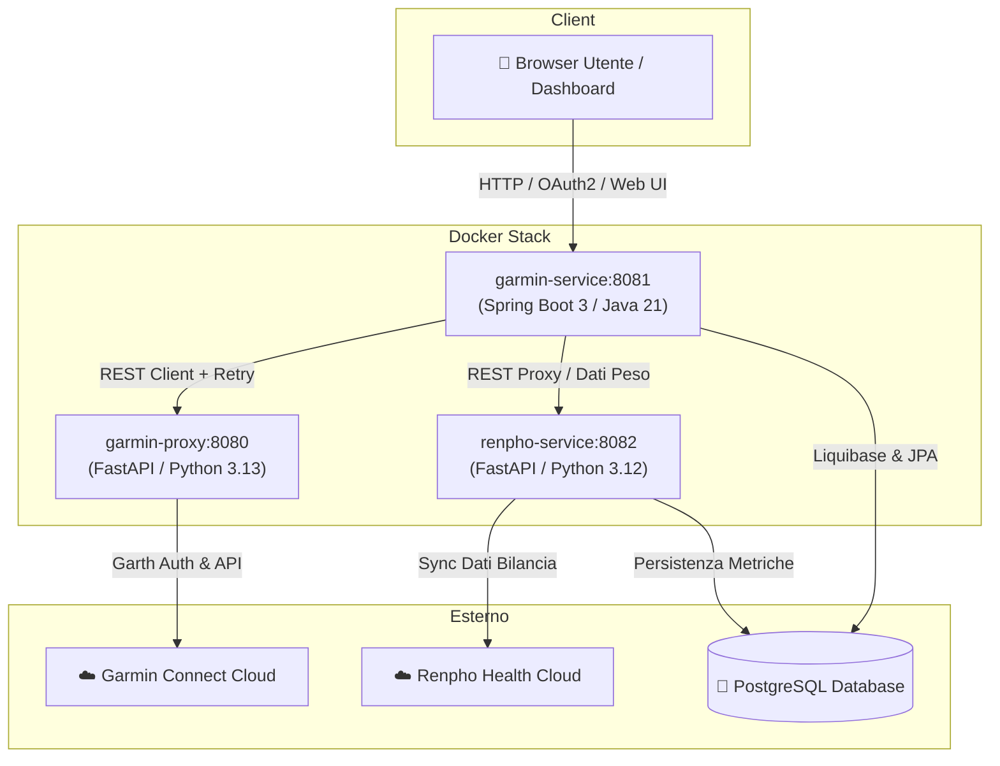

# 🏃‍♂️ Garmin & Renpho Fitness Platform 🏋️‍♂️

> Piattaforma completa a microservizi per la raccolta, sincronizzazione, analisi e visualizzazione avanzata dei dati di allenamento **Garmin Connect** e di composizione corporea **Renpho Smart Scale**.

---

## 📖 Indice

- [Panoramica](#-panoramica)
- [Caratteristiche Principali](#-caratteristiche-principali)
- [Architettura a Microservizi](#-architettura-a-microservizi)
- [Struttura del Progetto](#-struttura-del-progetto)
- [Configurazione e Variabili d'Ambiente](#-configurazione-e-variabili-dambiente)
- [Avvio in Locale (Development)](#-avvio-in-locale-development)
- [Deploy Automatico in Produzione (CI/CD & Watchtower)](#-deploy-automatico-in-produzione-cicd--watchtower)
- [Riferimento API](#-riferimento-api)
- [Sicurezza e Autenticazione](#-sicurezza-e-autenticazione)
- [Database e Migrazioni (Liquibase)](#-database-e-migrazioni-liquibase)

---

## 🌟 Panoramica

Questa piattaforma trasforma i dati grezzi di **Garmin Connect** e delle bilance intelligenti **Renpho** in una dashboard unificata e interattiva, salvando lo storico delle metriche su un database relazionale **PostgreSQL** per analisi a lungo termine senza dipendere esclusivamente dai cloud proprietari.

L'applicazione è progettata con un'architettura **a microservizi containerizzata** con Docker, garantendo scalabilità, isolamento dei processi e facilità di deploy.

---

## ✨ Caratteristiche Principali

### 🏃 1. Analisi Corsa e Zone Cardio (HR Zones)
- Estrazione automatica delle attività di corsa da Garmin Connect.
- Calcolo dettagliato del tempo trascorso nelle **5 zone di frequenza cardiaca** (Z1 - Riscaldamento fino a Z5 - Massimo).
- Persistenza storica su PostgreSQL e grafici temporali di distribuzione dell'intensità cardiaca.

### 🏋️ 2. Monitoraggio Allenamenti coi Pesi (Strength Workouts)
- Tracciamento delle sessioni di forza: serie, ripetizioni, carichi e volume totale (kg sollevati).
- **Mappatura personalizzata degli esercizi (Exercise Name Mapping)**: permette di rinominare e normalizzare gli esercizi Garmin (spesso con nomi generici o in inglese) in etichette personalizzate.
- Calcolo della progressione dei carichi e stima del volume per gruppo muscolare.

### ⚖️ 3. Composizione Corporea (Renpho Smart Scale)
- Sincronizzazione automatica dal cloud Renpho Health di tutte le metriche biometriche:
  - Peso corporeo, Indice di Massa Corporea (BMI).
  - Percentuale di massa grassa, massa muscolare scheletrica, massa magra.
  - Percentuale d'acqua, massa ossea, metabolismo basale (BMR).
- Dashboard dedicata con grafici sull'andamento del peso e della massa corporea nel tempo.

### 📊 4. Dashboard Web Interattiva
- Interfaccia grafica moderna (Glassmorphic design) responsive e fruibile da desktop e smartphone.
- Visualizzazione immediata di:
  - Ultimo allenamento di forza eseguito con dettaglio serie.
  - Distribuzione settimanale e mensile delle zone cardio di corsa.
  - Grafici di trend del peso e parametri Renpho.

---

## 🏗️ Architettura a Microservizi

L'applicazione è suddivisa in 3 microservizi indipendenti che comunicano tra loro all'interno della rete Docker:



### 1. `garmin-proxy` (Porta `8080`)
- **Linguaggio & Framework**: Python 3.13 / FastAPI / Uvicorn.
- **Scopo**: Gateway/proxy trasparente verso le API di Garmin Connect.
- **Funzionalità**:
  - Gestisce l'autenticazione OAuth e il refresh dei token Garmin memorizzati nel volume `/tokens`.
  - Meccanismo di auto-reautenticazione su errore `GarthHTTPError` per evitare sessioni scadute.
  - Protezione con `X-API-KEY`.

### 2. `garmin-service` (Porta `8081`)
- **Linguaggio & Framework**: Java 21 / Spring Boot 3 / Spring Security / Spring Data JPA.
- **Scopo**: Core applicativo, logica di business e server web della Dashboard.
- **Funzionalità**:
  - Serve la Web UI e le API REST.
  - Gestisce le migrazioni del database con **Liquibase**.
  - Si connette a `garmin-proxy` con meccanismo di retry esponenziale (`@Retryable`).
  - Gestisce la sicurezza con autenticazione via Form (Admin) e **OAuth2 Social Login (Google & Apple)**.

### 3. `renpho-service` (Porta `8082`)
- **Linguaggio & Framework**: Python 3.12 / FastAPI / Uvicorn.
- **Scopo**: Integrazione con le bilance intelligenti Renpho.
- **Funzionalità**:
  - Effettua il login su Renpho Health e recupera lo storico delle pesate.
  - Salva i dati direttamente su PostgreSQL.

---

## 📁 Struttura del Progetto

```text
python-garminconnect/
├── .github/
│   └── workflows/
│       ├── ci.yml                 # Pipeline CI (Linting, formattazione, tipi)
│       └── docker-publish.yml     # Pipeline CD (Build e push su GitHub Container Registry)
├── garmin-proxy/                  # Microservizio FastAPI per proxy Garmin
│   ├── Dockerfile
│   ├── requirements.txt
│   └── main.py
├── garmin-service/                # Microservizio Spring Boot (Core + Dashboard)
│   ├── Dockerfile
│   ├── pom.xml
│   └── src/main/
│       ├── java/it/giuseppefrattura/garminservice/
│       │   ├── controller/        # REST Endpoints
│       │   ├── service/           # Logica di business (Forza, Corsa, Mappature)
│       │   ├── security/          # Configurazione Spring Security & OAuth2
│       │   ├── repository/        # Spring Data JPA Repositories
│       │   └── model/             # Entità JPA
│       └── resources/
│           ├── application.yml
│           ├── db/changelog/      # Script di migrazione Liquibase (001, 002, 003...)
│           └── static/            # Frontend HTML5, CSS Glassmorphic e JS
├── renpho-service/                # Microservizio FastAPI per bilancia Renpho
│   ├── Dockerfile
│   ├── requirements.txt
│   └── main.py
├── garminconnect/                 # Libreria Python wrapper per API Garmin
├── docker-compose.yml             # Compose per sviluppo locale (build da sorgente)
├── docker-compose.prod.yml        # Compose per produzione (immagini GHCR + Watchtower)
└── .env                           # File di configurazione (credenziali ed endpoint)
```

---

## ⚙️ Configurazione e Variabili d'Ambiente

Crea un file `.env` nella radice del progetto configurando i seguenti parametri:

```dotenv
# --- Sicurezza & API Key tra i servizi ---
GARMIN_API_KEY=tua-chiave-segreta-123

# --- Database PostgreSQL ---
DB_HOST=192.168.1.xxx       # o localhost / nome host PostgreSQL
DB_PORT=5432
DB_NAME=garmin
DB_USER=postgres
DB_PASSWORD=tua_password_postgres

# --- Credenziali Dashboard (Form Login) ---
DASHBOARD_USER=admin
DASHBOARD_PASSWORD=tua_password_admin

# --- OAuth2 Login (Opzionale) ---
GOOGLE_CLIENT_ID=tuo-google-client-id
GOOGLE_CLIENT_SECRET=tuo-google-client-secret
APPLE_CLIENT_ID=tuo-apple-client-id
APPLE_CLIENT_SECRET=tuo-apple-client-secret

# --- Credenziali Renpho Health (Opzionale) ---
RENPHO_EMAIL=tua_email@renpho.com
RENPHO_PASSWORD=tua_password_renpho
```

### Autenticazione Garmin Token
Prima di avviare il proxy, assicurati che i token di autenticazione Garmin siano presenti nella directory `~/.garminconnect` del tuo host (generati tramite il modulo `garth` o con lo script di login `example.py`).

---

## 🚀 Avvio in Locale (Development)

Per avviare l'intero stack in locale compilando i container dai sorgenti:

```bash
# 1. Clona il repository
git clone https://github.com/giuseppefrattura/python-garminconnect.git
cd python-garminconnect

# 2. Configura le variabili d'ambiente
cp .env.example .env # compila con i tuoi valori

# 3. Avvia lo stack Docker
docker compose up --build -d

# 4. Controlla lo stato dei container
docker compose ps
```

Una volta avviato:
- **Dashboard Web**: [http://localhost:8081](http://localhost:8081)
- **Swagger UI (Documentazione API)**: [http://localhost:8081/swagger-ui.html](http://localhost:8081/swagger-ui.html)
- **Garmin Proxy Health**: [http://localhost:8080/health](http://localhost:8080/health)

---

## 🚢 Deploy Automatico in Produzione (CI/CD & Watchtower)

Il progetto è predisposto per il deploy continuo e automatico sul proprio server domestico o cloud (es. `192.168.1.64`).

### 1. Come Funziona il Flusso
1. Ad ogni `git push` sul branch `master`, la GitHub Action [`.github/workflows/docker-publish.yml`](file:///.github/workflows/docker-publish.yml) compila le 3 immagini Docker e le carica su **GitHub Container Registry (GHCR)**:
   - `ghcr.io/giuseppefrattura/garmin-proxy:latest`
   - `ghcr.io/giuseppefrattura/garmin-service:latest`
   - `ghcr.io/giuseppefrattura/renpho-service:latest`
2. Sul server di produzione, il container **Watchtower** presente in [`docker-compose.prod.yml`](file:///docker-compose.prod.yml) effettua il polling periodico su GHCR. Quando rileva nuove immagini, le scarica ed esegue il riavvio controllato dei container a caldo.

### 2. Avvio sul Server di Produzione
Sul server di produzione (`192.168.1.64`):

```bash
# Avvia lo stack in produzione con Watchtower
docker compose -f docker-compose.prod.yml up -d
```

---

## 🔌 Riferimento API

I microservizi espongono endpoint RESTful documentati via OpenAPI/Swagger.

### Endpoint Principali di `garmin-service` (Porta 8081)

| Metodo | Endpoint | Descrizione |
| :--- | :--- | :--- |
| `GET` | `/api/last-strength-workout?limit=30` | Restituisce l'ultimo allenamento di forza con serie, carichi, ripetizioni e volume totale. |
| `GET` | `/api/run-hr-zones?days=10` | Restituisce le zone cardio delle corse degli ultimi *N* giorni (in sola lettura). |
| `POST` | `/api/run-hr-zones/persist?days=10` | Scarica le corse da Garmin e le salva/aggiorna su PostgreSQL. |
| `GET` | `/api/exercise-mappings` | Recupera la lista di tutte le mappature personalizzate dei nomi degli esercizi. |
| `POST` | `/api/exercise-mappings` | Crea o aggiorna la mappatura di un nome esercizio Garmin. |
| `GET` | `/api/renpho/latest` | Recupera l'ultima rilevazione di peso e composizione corporea. |
| `GET` | `/actuator/health` | Healthcheck dello stato dell'applicazione e connessione DB. |

### Endpoint di `garmin-proxy` (Porta 8080)

| Metodo | Endpoint | Descrizione |
| :--- | :--- | :--- |
| `GET` | `/api/activities` | Lista delle attività recenti Garmin. |
| `GET` | `/api/activities/{activity_id}/exercise-sets` | Dettaglio delle serie e degli esercizi di un allenamento di forza. |
| `GET` | `/api/activities/{activity_id}/hr-zones` | Distribuzione dei secondi per ogni zona cardiaca dell'attività. |
| `GET` | `/health` | Healthcheck del proxy e verifica validità token Garmin. |

---

## 🔒 Sicurezza e Autenticazione

- **Comunicazione Inter-Service**: La comunicazione tra `garmin-service` e `garmin-proxy` è protetta tramite header `X-API-KEY`.
- **Autenticazione Dashboard**:
  - **Form Login**: Accesso protetto con credenziali configurabili (`DASHBOARD_USER` / `DASHBOARD_PASSWORD`).
  - **OAuth2 Social Login**: Integrazione opzionale per login con account Google o Apple.
- **Protezione Dati Personali**: Le sessioni e i token Garmin non contengono password in chiaro ma token OAuth crittografati gestiti in volumi protetti.

---

## 🗄️ Database e Migrazioni (Liquibase)

Le tabelle del database PostgreSQL vengono create e aggiornate automaticamente all'avvio di `garmin-service` tramite **Liquibase** (`garmin-service/src/main/resources/db/changelog/`):

- **`001-create-running-hr-zones.yaml`**: Tabella per memorizzare le corse con i minuti trascorsi nelle zone cardio 1-5.
- **`002-create-exercise-name-mapping.yaml`**: Tabella per salvare i mapping personalizzati dei nomi degli esercizi di forza.
- **`003-create-strength-workouts.yaml`**: Tabelle relazionali `strength_workouts` e `strength_workout_sets` per lo storico completo delle serie e dei massimali.

---

## 📄 Licenza

Distribuito sotto licenza **MIT**. Consulta il file [`LICENSE`](file:///LICENSE) per ulteriori dettagli.
